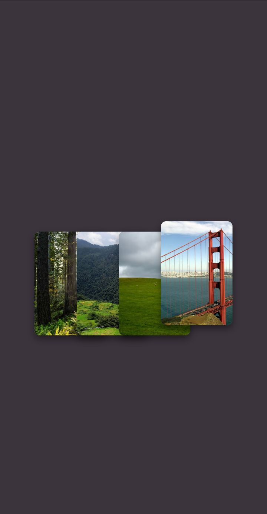

# 🖼 Gallery Project

Aplicación web que muestra una **galería de imágenes moderna y responsive**, diseñada para practicar maquetación web y estilos visuales.

Este proyecto forma parte de ejercicios de desarrollo web enfocados en **HTML, CSS y JavaScript**.

---

# 🚀 Demo del proyecto

👉 Ver la galería en funcionamiento

[](https://carlosdm121.github.io/gallery-project-1/)

---

# 🖥 Vista previa



---

# 🛠 Tecnologías utilizadas

<p align="left">


</p>

---

# 📌 Descripción

Este proyecto consiste en una **galería de imágenes interactiva** donde se muestran diferentes fotografías organizadas en un diseño limpio y visualmente atractivo.

El objetivo principal es practicar:

- estructura HTML
- estilos con CSS
- interacción básica con JavaScript
- diseño responsive

---

# ⚙️ Funcionalidades

✔ Visualización de imágenes en galería  
✔ Diseño responsive adaptable a móviles  
✔ Estructura moderna de maquetación  
✔ Interfaz visual simple y clara  

---

# 📂 Estructura del proyecto

```
gallery-project-1
 ├── index.html
 ├── style.css
 ├── script.js
 └── README.md
```

---

# ▶️ Cómo ejecutar el proyecto

Clonar el repositorio:

```
git clone https://github.com/carlosdm121/gallery-project-1.git
```

Abrir el archivo:

```
index.html
```

en tu navegador.

---

# 👨‍💻 Autor

Carlos Martinez  

GitHub  
https://github.com/carlosdm121

---

⭐ Si te gustó este proyecto puedes darle **Star** al repositorio.
